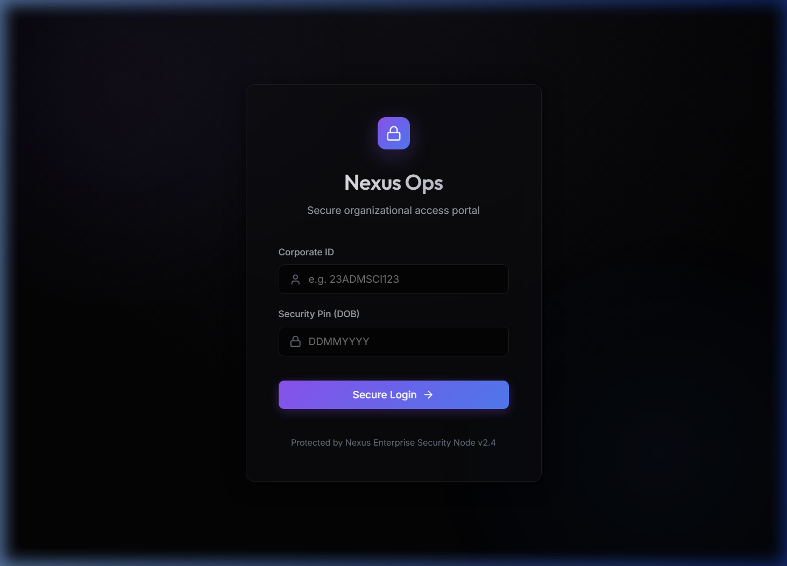
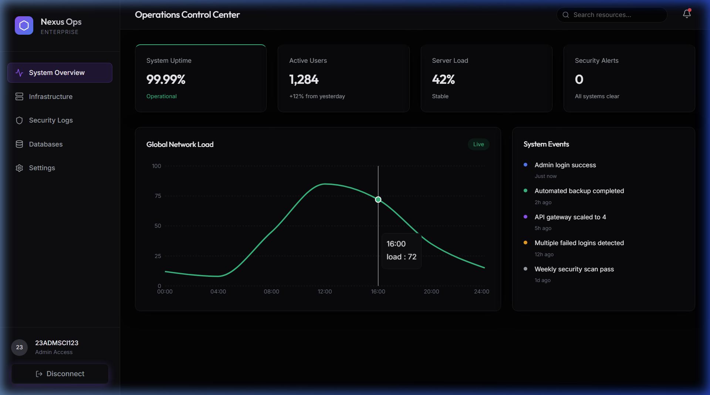
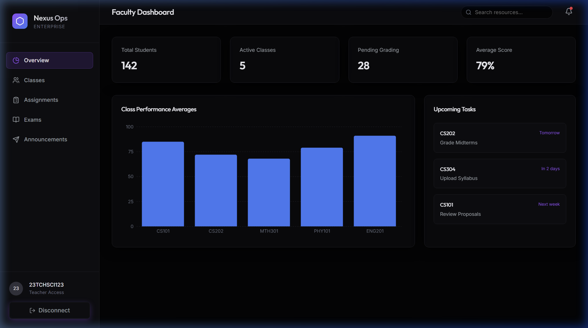
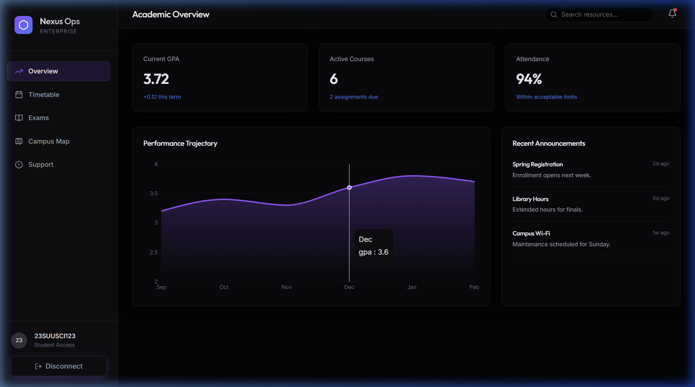

# Nexus Ops

Nexus Ops is a premium B2B Software as a Service (SaaS) application redesigned to provide enterprise-grade operational management and monitoring. The platform leverages modern design patterns, deep dark-mode aesthetics, and performant data visualization tools to deliver an optimal experience across multiple user roles.

## Version
Update v2.0

## Key Features

*   **Role-Based Access Control**: Securely partitions the application into distinct dashboards for Administrators, Faculty, and Students.
*   **Operations Control Center**: Real-time system telemetry and network load visualization utilizing Recharts.
*   **Academic Progression Tracking**: Data-rich views for student performance trajectory and active coursework.
*   **Faculty Management**: Centralized hub for managing class averages, upcoming grading tasks, and cross-course analytics.
*   **Premium Component System**: Built on a reusable `DashboardLayout` component ensuring consistent styling, efficient navigation, and responsive constraints across all viewports.
*   **Performance Optimization**: Utilizes lightweight CSS keyframe animations for robust rendering logic, avoiding heavy DOM-manipulation libraries.

## Technology Stack

*   **Frontend Environment**: React 19, Vite
*   **Styling Architecture**: Vanilla CSS with structural CSS variables and glassmorphism design principles
*   **Data Visualization**: Recharts
*   **Iconography**: Lucide React
*   **Backend Environment**: Node.js, Express (API handling and mocked dataset endpoints)

## Installation and Setup

1.  Clone the repository:
    ```bash
    git clone https://github.com/dhruva-markovblanket/nexus-ops.git
    cd nexus-ops
    ```

2.  Install Backend Dependencies:
    ```bash
    cd backend
    npm install
    npm start
    ```

3.  Install Frontend Dependencies:
    ```bash
    cd ../frontend
    npm install
    npm run dev
    ```

4.  Access the application at `http://localhost:5173`.

## Test Credentials

*   **Admin Access**: 
    *   Corporate ID: `23ADMSCI123`
    *   Security Pin: `01012000`
*   **Teacher Access**: 
    *   Corporate ID: `23TCHSCI123`
    *   Security Pin: `01012000`
*   **Student Access**: 
    *   Corporate ID: `23SUUSCI123`
    *   Security Pin: `01012000`

## Interface Architecture

### Secure Authentication Portal
A tailored entry point implementing structural validation and secure state handling before application ingress.



### Operations Control Center (Admin)
Enterprise network monitoring and continuous event logging overview.



### Faculty Dashboard (Teacher)
Analytical views for class performance and syllabus task tracking.



### Academic Overview (Student)
Focused environment tracking term-over-term GPA changes and pending academic requirements.


